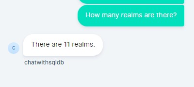

# Chatwoot agent bot for Langchain

This is the sample implementation of agent bot capabilities for langchain (`SQLDatabaseChain`).

> If you running the Chatwoot server on docker. Please make sure that chatwoot server and this service can communicate each other. In otherway you can use ngrok to expose the service publicly.
> How to [install ngork](https://ngrok.com/download).

## How to run

Clone this project and goto the directory `langchain-agent-bot-sqlchat` and follow below steps.

### Create virtual environment and activate

```bash
python3 -m venv .venv
source .venv/bin/activate
```

### Install the dependency

```bash
pip install -r requirements.txt
```

### Update variables

Update the below variables in [app.py](app.py#L7)

```py
# Database details
postgresql_host = ''
postgresql_port = ''
postgresql_user = ''
postgresql_pass = ''
postgresql_dbname = ''

# OpenAI API Key
key = ''

# Include only tables that you needed
include_tables=[]

# ChatWoot config
chatwoot_url = ""
chatwoot_bot_token = ""
```

### Run

```bash
python3 -m gunicorn app:app
```
**Update the agentbot `OUTGOING URL` to http://localhost:8000/langchain**

### Sample output


## To use different database

Update the `conn_stg` variable in the [app.py](app.py#L24)

Given script supports PostgreSQL and default to `public` schema. For other database check [sqlalchemy dialect](https://docs.sqlalchemy.org/en/20/dialects/)
